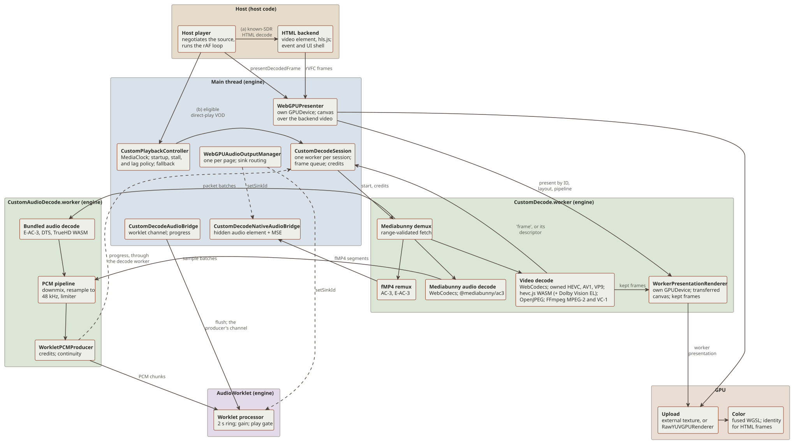
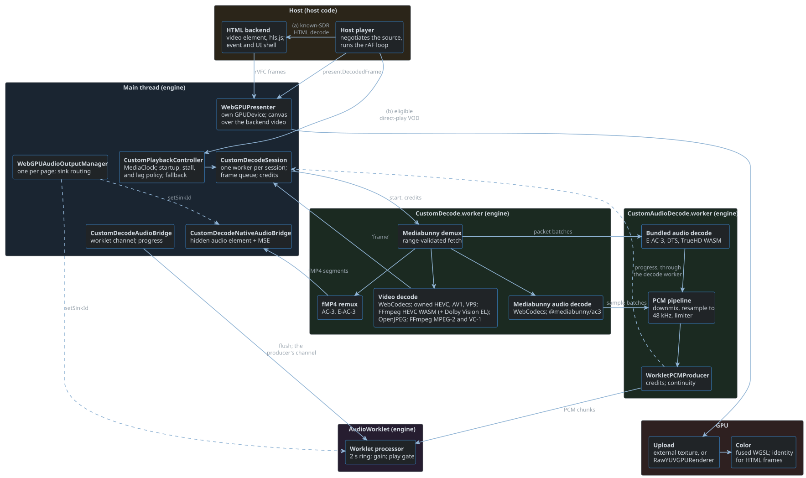
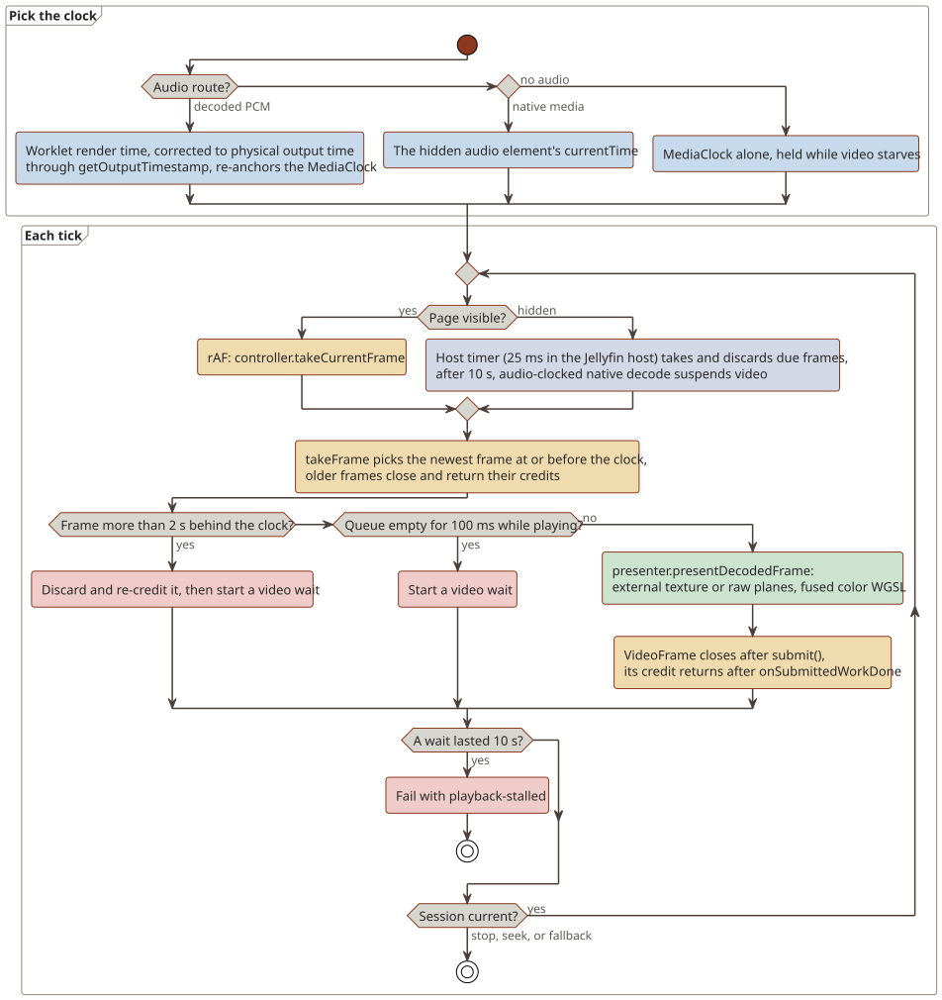
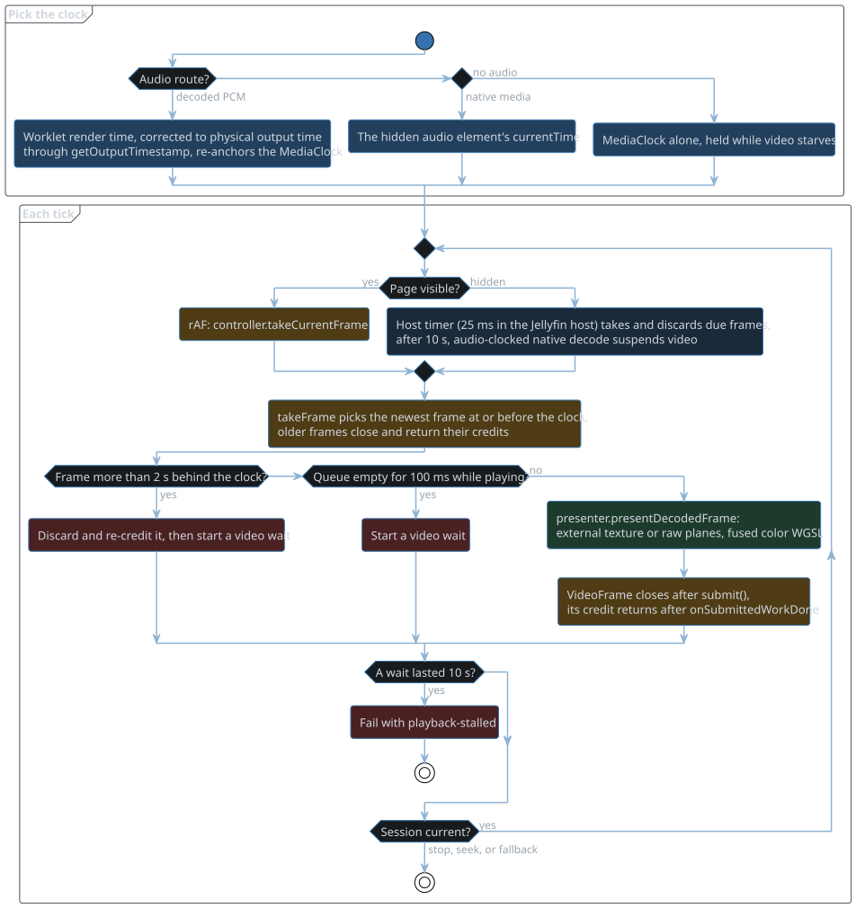
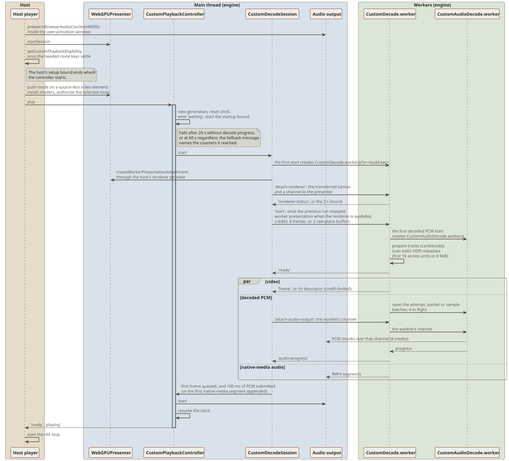
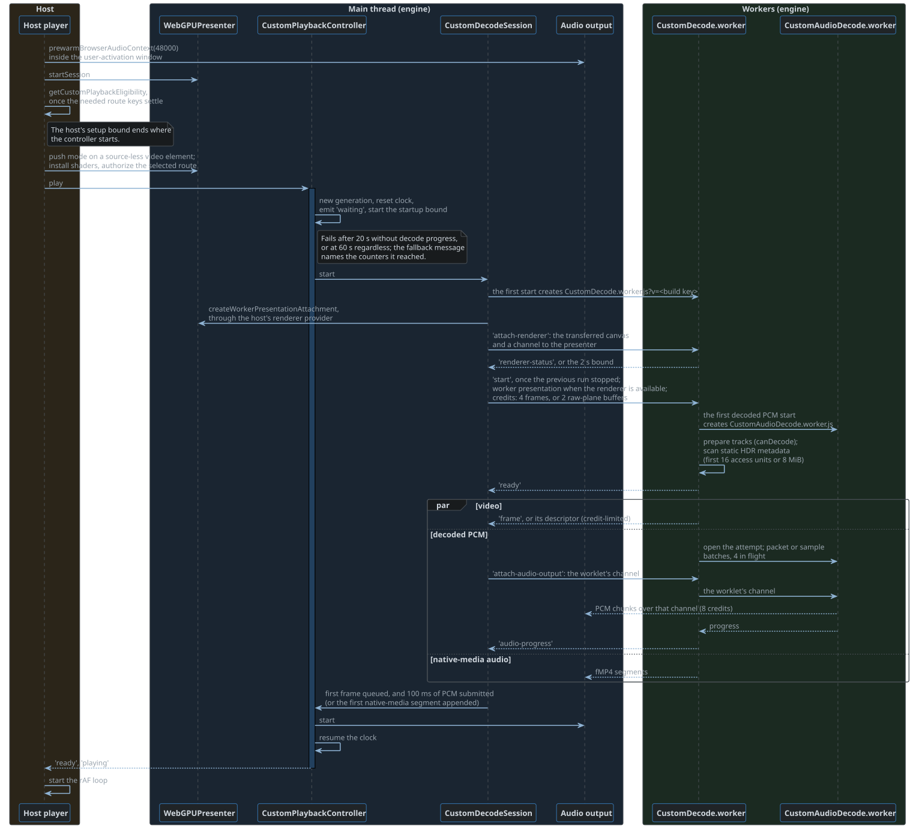

# Architecture

## Layers

A session takes one of two paths:

- (a) HTML decode with WebGPU presentation, for known-SDR input only.
  The `<video>` element or hls.js decodes, and the media element is the clock.
  Frames go rVFC, `importExternalTexture`, identity WGSL, canvas.
  For HDR or unknown input the presenter is off and the `<video>` shows.
- (b) The custom pipeline, for eligible direct-play VOD.
  The worker posts `'frame'` messages (a `VideoFrame`, or raw planes in a pooled buffer, with Dolby Vision and HDR10+ metadata) and `'audio'` messages (f32 planar PCM, or fMP4 segments).
  The host's rAF loop takes the controller's current frame and presents it.
  Decoded audio plays through an AudioWorklet in a pooled 48 kHz context, and AC-3 and E-AC-3 can play through a hidden `<audio>` element and MSE.

The host player, its HTML backend with any hls.js runtime, and the rAF loop are host code.
Everything else in the diagram is engine code.
The plugin's book follows the Jellyfin host's half of a session.

## Clock

- Decoded PCM: the worklet's render time, corrected to physical output time by `BrowserCustomAudioOutput` through `getOutputTimestamp`, re-anchors a `performance.now` `MediaClock`.
  After each flush the worklet renders silence from the flush position up to the first chunk's timestamp, so an audio track that starts later than the video still clocks from the start position.
- Native-media audio: `<audio>.currentTime`.
  A first fragment more than 40 ms after the start position parks the element at the fragment, and `play()` waits out the gap while the `MediaClock` runs alone.
- No audio: `MediaClock` alone, held while video starves.
  An audio track that ends before the video hands the clock to the `MediaClock` once its tail has played out.

Video is pulled: each rAF draws the newest frame at or before the clock.

## Startup of a custom session

1. The host runs `prewarmBrowserAudioContext(48000)` synchronously inside its play call (the user-activation window) and calls `presenter.startSession`.
2. The host runs eligibility, described in [Eligibility and routes](routes.md), once the authorization keys the source needs have settled.
   Its own setup bound should end where the controller starts, so the controller's startup bound applies after that.
3. The host gives the presenter a source-less `<video>`.
   The presenter enters push mode, and the host installs the shaders and authorizes the selected route through the presenter.
4. `controller.play` creates a generation, resets the clock, emits `waiting`, and starts the startup bound.
   It samples the decode counters every second and fails after 20 s without progress, or at 60 s regardless.
   The fallback message names the counters it reached, so a timeout shows where startup stalled.
   `CustomDecodeSession.start` creates the prebuilt worker `libraries/webgpu-player/CustomDecode.worker.js`, keyed per build with `?v=`.
   Video gets 4 frame credits, or 2 for raw planes.
5. The worker prepares its tracks (`canDecode`), scans the static HDR metadata of the first 16 access units or 8 MiB, and posts `ready`.
   It scans HEVC SEI on the native PQ route, and AV1 MDCV and CLL metadata OBUs when the first sequence header signals PQ and no RPU route is selected.
   Video and audio then stream concurrently.
6. The session is ready when the first frame is queued and at least 100 ms of PCM has been submitted, or, on the native-media audio route, when the first segment is appended.
7. `completeStartupIfReady` starts audio, resumes the clock, and emits `ready` and `playing`.
   The host then starts its rAF loop.

## Steady state

| Thread | Work |
| --- | --- |
| main | rAF loop, controller, session, presenter, audio bridges, sink manager, MSE `<audio>` |
| worker, one per generation | demux, decode, raw copy, Dolby Vision and HDR10+ metadata, PCM conversion, fMP4 remux |
| AudioWorklet | 1024-frame chunks in a 2 s ring, gain, play gate, periodic telemetry |
| GPU | the presenter's queue, which the authorization probes share |

Video credits:

- `takeFrame` closes and re-credits older frames.
- A presented `VideoFrame` closes after `submit()`, but its credit returns only after `queue.onSubmittedWorkDone()`.
  This keeps the decoder's surfaces from starving.
- In raw mode the pooled buffer is the credit, and it returns through `recycle-frame`.
- The owned HEVC, AV1, and VP9 paths read a packet only while they hold a credit.

Audio credits:

- PCM chunks are 40 ms to 12000 frames, with 8 credits, so the credits can never hold more than the 2 s worklet ring.
  One credit returns per chunk the worklet consumes.
  The worker reconciles decoder timestamps within 2 s before the resampler (see [Decisions](decisions.md#audio)), and fails the attempt as `decode-failed` beyond that.
  A gap, an overlap, or an overflow that reaches the bridge is therefore an engine fault, and raises `audio-output-failed`.
- Native-media audio uses 2 MiB or 2 s segments, 2 credits, and appends at most 6 s ahead.

Lag guard, in `CustomPlaybackController`:

- A frame more than 2 s behind the clock is discarded and re-credited, and a video wait starts.
- An empty queue for at least 100 ms while playing also starts a wait.
- A wait of 10 s or more fails with `playback-stalled`.

Hidden page, through `setPageVisibility` and `drainBackgroundVideo`:

- No rAF runs while the page is hidden, so the host takes and discards due frames against the clock on a timer (25 ms in the Jellyfin host).
  Credits keep flowing and audio stays the master.
- After 10 s hidden, audio-clocked `native` decode sends `suspend-video`.
  The worker unwinds only its video attempt and releases the decoder.
  Once the audio track has ended, only video can reach the end of the stream, so video is no longer suspended and `audio-ended` resyncs a suspended decoder at once.
- On return, a suspended video, or one more than 2 s behind, gets `resync-video` at the clock.
  The worker restarts video alone at the preceding keyframe and skips frames before the target.
  Waits restart, so hidden time never counts toward `playback-stalled`.
- Every resync or suspension advances the video epoch.
  Frames carry `videoEpoch`, and the session closes frames of a replaced epoch and returns their credits.
- A reclaimed WebCodecs decoder (`QuotaExceededError`) posts `video-interrupted`.
  Video resyncs at once when visible, and on return when hidden.
- When audio outlasts the video track, the worker posts `video-ended` before the run's `ended`, and the controller holds the last frame without waiting, stalling, suspending, or resyncing.

Geometry: `WebGPUPresenter.bindLayoutHandling` invalidates layout on resize observers, class and style mutations of the video and its ancestors, CSS motion events, window resize, seek, and refresh.
The backing size is the CSS size times the device pixel ratio, capped by `maxTextureDimension2D`.

## Transitions

- Seek: a new presentation generation, then `controller.seek`, then a new generation and a new worker at the target.
  The owned HEVC, AV1, and VP9 paths start at the preceding key packet.
  DTS and TrueHD use a 1 s preroll.
  The host drops stale seek results by its own revision.
- Audio track switch: eligibility runs again.
  If the source is no longer eligible, the session renegotiates; otherwise it restarts as a seek at the current time.
  Downmix gain changes apply live with a 20 ms ramp.
- Audio output layout switch (`controller.reconfigureAudioOutput`): a new device layout, force stereo, or a new downmix algorithm restarts only decoded audio while video keeps playing.
  The requested channel count is a ceiling applied to the decoded source layout, which the worker reports with `audio-source-format`: three channels and 5.1 take 5.1, 6.1 and 7.1 take 7.1 or fold into 5.1, and anything else mixes to stereo.
  A request that keeps the layout only records its downmix for later restarts, and a newer request replaces a pending switch.
  1. The controller stops the output and picks a target 250 ms ahead of the clock (the current time when paused or waiting on an audio underflow).
  2. `session.resyncAudio` stops the old bridge and advances the audio epoch.
     `BrowserCustomAudioOutput.reconfigure` retires the worklet, sets `destination.channelCount`, and leases a worklet with the new channel count on the same context and sink.
  3. The worker gets `resync-audio`: its audio attempt unwinds, and a new one starts at the target with a rebuilt downmix, resampler, and limiter (DTS and TrueHD keep their preroll).
     Samples and credits are tagged with the epoch, so stale ones are dropped.
  4. Once the new epoch has buffered 100 ms, the output starts when the clock reaches the target.
     Audio telemetry does not move the clock in between.
     A clock that waited on the old output's underflow resumes at this point, because the new output starts full and never reports a recovery.
     A pause holds the start, and resume counts down to the target again.

  A failure, or a fill that exceeds 5 s, falls back to HTML in the same session.
  The host triggers the switch, for example when the output reports `sinkchange` with a different channel count.
- Pause: the clock pauses and the worklet is gated to silence.
  The AudioContext keeps running; the pool suspends it only when idle.
  A playback rate other than 1 with audio falls back to the HTML player in the same session.
- GPU device loss: one recovery per session.
  The new device must re-authorize the active HDR, Dolby Vision, or raw route before it draws.
  If that fails, `device-recovery-failed` falls back to HTML.
- Audio sink change (`WebGPUAudioOutputManager`): the default sink is `setSinkId('')`.
  The fallback chain is the selected device, then the default, then the first enumerated device.
  A route whose sink ID is unchanged is left alone, because browsers ignore a same-ID `setSinkId`.
  Decode, worklet, and queues never restart for a sink change.
- Output device recovery: Chromium binds an AudioContext created with no output device to a fake output for its whole life.
  The pool detects such a context at creation and closes it on release instead of pooling it.
  While one is in use, or a context has reported `error`, the router polls `enumerateDevices()` once a second, because Chromium sends `devicechange` only with microphone permission.
  Each poll that lists an output runs a recovery pass, without a retry limit: it rebuilds the sink with `setSinkId({ type: 'none' })` and then the requested sink, and resumes.
  Polling runs only while the page is visible; a hidden page stops it and probes again as soon as it becomes visible.
  The rebuilt sink reports `sinkchange`, so a surround device switches the session's layout at once.
- Re-detect output (`WebGPUAudioOutputManager.redetectAudioOutputs`, offered by the host's settings): rebuilds every AudioContext sink so the browser re-reads the device.
  Chromium moves a default output to a new device without telling the page, which leaves a stale channel count until a rebuild.
- End of stream: the worker flushes the resampler and limiter tails and posts `ended`.
  The controller emits `ended` once the bridge and worklet queues are empty, the output time has reached the end, and the video queues are empty.
- Audio ends first: the worker posts `audio-ended` (epoch-tagged) when an audio attempt finishes while video continues, and ends the run only once the video track itself has ended.
  The worklet's final underflow releases the audio tail instead of starting an audio wait that would end in `playback-stalled`.
  Unlike the end of stream drain, video waits stay in force and an uncorrelated output does not pause the clock; once the tail is out, video starvation holds the clock.
  The end also completes a start or audio resync that has no PCM left to wait for.
  A native-media session sends `endOfStream`, so `<audio>` plays out, and the clock then runs without the element.
- Stop: `controller.destroy` stops the worker (terminated after 1 s), releases the worklet and the sink lease (1.5 s cap), and ends the presenter session.

## Fallback and renegotiation

`pipeline/CustomPlaybackController.ts:getFallbackDisposition` decides what a failure does:

| Disposition | Reasons |
| --- | --- |
| HTML player, same session | audio-output-failed, audio-output-unavailable, lifecycle-failed, playback-rate-unsupported |
| Renegotiate the source | decode-failed, ended-before-ready, network-failed, playback-stalled, range-unsupported, source-unsupported, startup-timeout |

- The host carries out each disposition, and may renegotiate on every reason when its HTML player cannot play the source.
- Failures in the host's wrapper (presenter, frame submission, rAF) are `lifecycle-failed`.
- Fallback never selects another player.

Every stale callback is dropped by a generation or revision check:

- The host: its own generations and revisions.
- The controller: `activeGeneration` and `fallbackGeneration`.
- The session: one worker record per generation.
- The worklet: its flush generation.
- The presenter: `deviceResourceEpoch`, the color and layout revisions, and `fallbackLatched`.

## Gotchas

- External textures of high-bit-depth frames are 8 bits per channel in Chromium (see [Decisions](decisions.md)).
  Authorization tolerances follow: external HDR 10/255, external Dolby Vision 8/255, raw 3/255.
- The native external HDR route rewrites the SPS color to limited BT.709, and the shader recovers the 10-bit codes (`Y*876+64`, `C*896+512`).
  A frame with a colorSpace that is not neutral latches `decoded-frame-color-mismatch`.
- The raw route checks each frame's colorSpace against the metadata, and a null member is unspecified, so it never contradicts.
  SDR also matches a `smpte170m` transfer, and HLG a `bt709` transfer on BT.2020 primaries.
- WebGPU presentation on the HTML path is SDR only: a `<video>` external texture is browser-converted sRGB.
- Worker track indices are container ordinals, not Jellyfin `MediaStream.Index`.
- Every seek, audio switch, and paused repaint starts a new worker that reopens the input.
  The 32 MiB read cache belongs to one worker.
- Decoded PCM gain (volume cubed times normalization) is applied after the limiter and is not capped, so a boost can clip; clipping is counted.
  The native-media route caps gain at 1.
- `DecodedVideoGeometry` locks the first decoded size of a run, with a 64 px tolerance.
  A later size change fails the session.
- The negotiated `maximumCoded*` is Jellyfin's cropped `Width` and `Height`, while containers and decoders report block-aligned sizes (mkvmerge can declare 2080 lines for a 2076-line HEVC picture).
  Route checks allow the same 64 px through `exceedsNegotiatedCodedSize`.
- Jellyfin's cross-origin 206 hides `Content-Range`.
  It is accepted only for `/Videos/{id}/stream` with a bounded `Content-Length` (`pipeline/HTTPRangeResponse.ts`).
