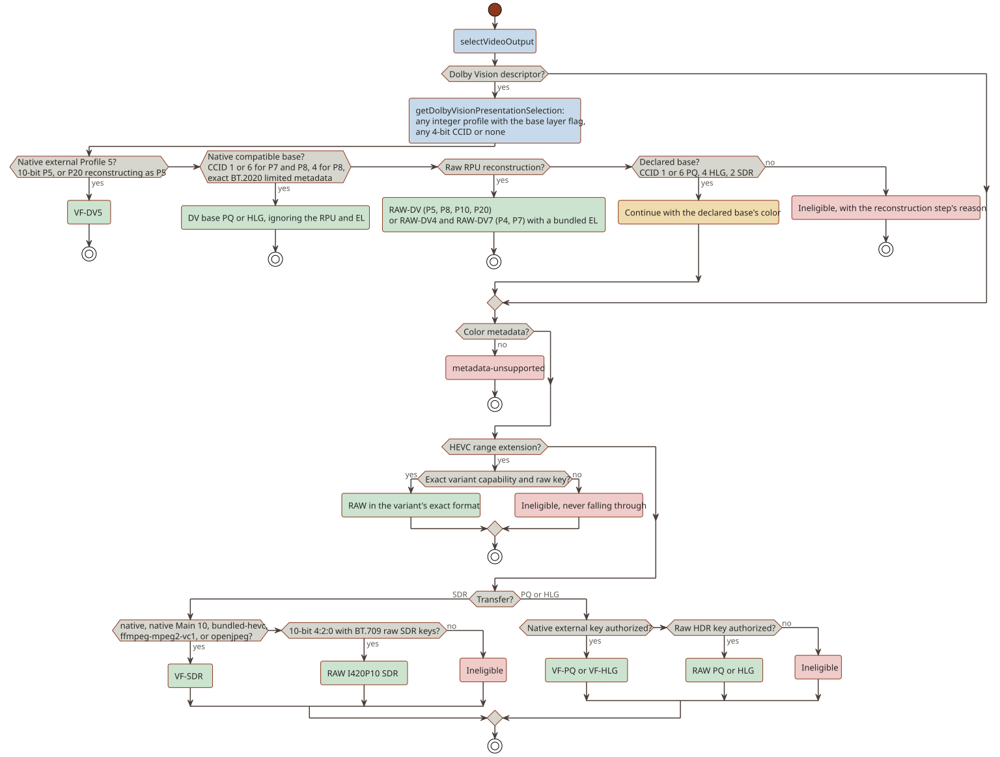
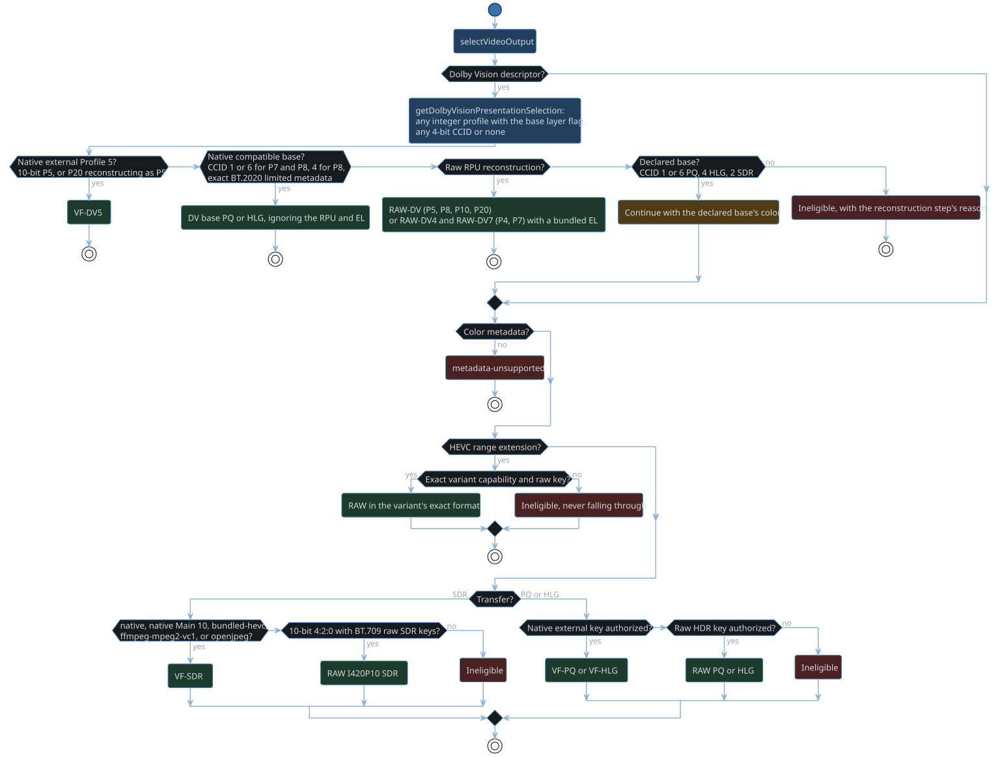
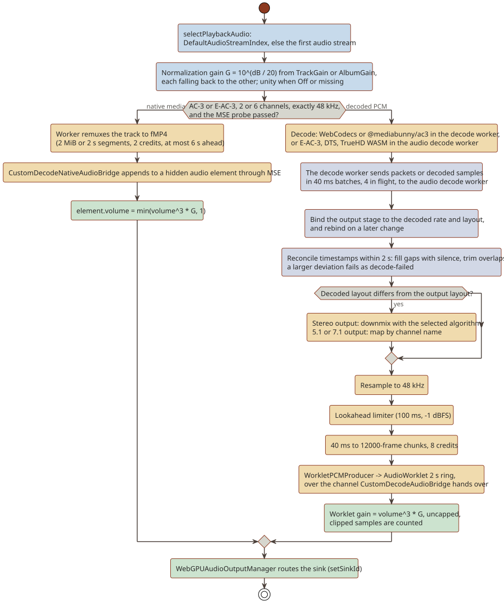
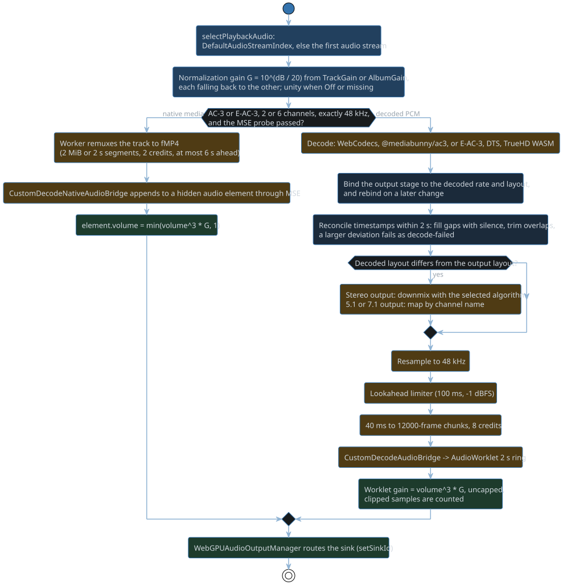

# Eligibility and routes

This chapter follows a source from the engine's capability evidence to a concrete decode and presentation route.
The host turns the same evidence into what it advertises to its server; the Jellyfin plugin's book describes its device profile.

## Host entry points

A host calls these, in this order, for each playback:

1. `CustomPlaybackEligibility.hasPotentialCustomPlaybackVideoRoute`, the metadata-only prefilter, when it chooses a player.
   The prefilter declines a source whose containers no route in `CUSTOM_CONTAINER_CODEC_RULES` carries, such as AVI, FLV, ASF, or an MPEG program stream.
   It also declines a video codec no route decodes, such as MPEG-4 Part 2 (DivX, Xvid), H.263, MS-MPEG4, MPEG-1, or Theora, and interlaced or rotated video.
2. `CustomPlaybackRuntime.getCustomPlaybackRuntimeAvailability`, which fails without a secure context, Worker, `navigator.gpu`, or `VideoFrame`.
3. `probeCustomDecodeCapabilities(item)`, the native-media audio probe, and the GPU authorizations the item needs (5 s each), before it advertises anything; see [Probes and caching](#probes-and-caching).
4. `hasEligibleCustomVideoRoute`, to ask whether the runtime would present one item with the measured capabilities and authorizations.
5. `getCustomPlaybackEligibility`, when the session starts, with the route flags and authorized keys of `CustomPlaybackEligibilityOptions`.
   `allowRawSDR` needs only a settled `:sdr` raw key.

## Eligibility

`getCustomPlaybackEligibility` checks in order:

1. `parsePlaybackSource`: DirectPlay, not live, a custom container, and an http(s) URL.
   A missing or zero `RunTimeTicks` is an unknown duration, not a rejection.
   Playback then ends with the streams, audio takes the decoded-PCM route because the native media backend needs a duration, and the worker reports the container's duration on `ready`.
2. `selectVideoStream`.
3. Rotation 0 and `IsInterlaced === false`.
4. `selectVideoOutput` (below).
5. `selectPlaybackAudio`.
6. `supportsCustomContainerCodecCombination`.
7. The runtime budget.

An ineligible result carries its reason, and the host falls back.

## Probes and caching

- Main thread: WebCodecs configuration and decoded-output probes, raw `copyTo` fingerprints, the per-profile H.264 probe, and the MSE AC-3/E-AC-3 probe.
- Dedicated workers: bundled HEVC (FFmpeg), DTS (libdcadec), TrueHD/MLP (FFmpeg), JPEG 2000 (OpenJPEG), and MPEG-2/VC-1 (FFmpeg).
- GPU: presentation authorization reads back renders of the production shaders.
  Results are cached per `GPUDevice`, canvas format, and shader signature, and dropped on device loss.
- `selectCustomDecodeProbes(item)` picks the probes an item needs.
  Every audio probe runs for every item, because a playing item can switch to any of its audio tracks.
  The video probes follow the union of the video streams across the item's sources: the codec picks the native and bundled probes, a range extension picks its own variants, a stream beyond 8-bit SDR adds the raw-plane and native HDR probes, and a range that is neither SDR nor static HDR adds the Dolby Vision probe.
  An HDR item also runs the HEVC and AV1 probes, because an HDR transcode targets those codecs and their ranges bound it.
  An item without stream metadata, or with a video stream that names no codec, runs every probe.
- A probe the item does not select reads `not-probed`, which no profile rule or eligibility check treats as support, and its exact result is absent; `probeStates` records which probes a result ran.
  At eligibility, the host keeps the negotiated result when `hasProbedCustomDecodeSelection` says it covers the played source, and otherwise probes that source.
- A run downloads every selected probe's assets at once when it starts: each exact probe's `prepare` fetches its qualification vector and decoder binary as bytes and warms its worker script and glue in the HTTP cache, and every selected range-extension vector starts downloading.
  A probe's downloads finish before its decode timeout starts, under their own 30 s bound (`capability/CapabilityAssetLoading.ts`), so a slow link never reads as a slow decoder or trips the queue's timeout.
  A download that fails with a network error, 408, 429, or 5xx is retried after 250 ms and again after 1 s, inside the same 30 s bound; any other HTTP failure, or the bound ending, is final.
  The worker receives the binary as bytes through `DecoderWASMSource`; a failed download reports `asset-unavailable` with an unknown status.
- Each probe is one module-level promise for the page's lifetime and is never invalidated, so a later item runs only the probes no earlier item ran.
  `SerializedHeavyCapabilityProbeScheduler` runs the heavy probes one at a time, audio first; after one times out, later heavy probes report a timeout until the page reloads.

## Route catalog

| Backend literal | Output | Qualifying evidence | Gate |
| --- | --- | --- | --- |
| `native` SDR | `video-frame` | H.264 per-profile keyframes; HEVC 1080p access unit; VP8, VP9, AV1 64x64; 4K variants | `getOrdinarySDRVideoSelection` |
| `native` HEVC Main 10 HDR, Dolby Vision base | `video-frame`, with `nativeHDRTransfer` pq or hlg, neutralized | 4K Main 10 access unit decode, plus external HDR or Dolby Vision GPU authorization | `supportsNativeMain10HEVC`, `selectNativeDolbyVisionBaseOutput` |
| `native` raw | `raw-planes`: I420P10 for HDR, 10-bit SDR, and Dolby Vision (HEVC Main 10, AV1 Main, VP9 Profile 2), I420 to I444P12 for range extensions | `copyTo` plane fingerprints; nine 192x192 two-access-unit range-extension probes; raw GPU authorization | `supportsRawHDRVideo`, `selectHEVCRangeExtensionVideoOutput` |
| `bundled-hevc` | `video-frame` (Main SDR), `raw-planes` I420 (Main Dolby Vision) and I420P10 | A worker probe: 8-frame fingerprints for main-1080p, main10-1080p, main10-4k | `hasSupportedBundledHEVCProfile`; native wins |
| `ffmpeg-mpeg2-vc1` | `video-frame` I420 | MPEG-2 Main and VC-1 Advanced, 12 frames, Matroska only | `getMPEG2VC1SDRSelection` |
| `openjpeg` | `video-frame` RGBA | A 960x540 sRGB vector, MOV/MJ2 | `getJPEG2000SDRVideoSelection` |
| DTS, libdcadec | `decoded-pcm` | 7 vectors, downmix fingerprints, real-time factor of at least 2 | `isSupportedDTSInputRoute` |
| TrueHD/MLP, FFmpeg | `decoded-pcm` | 4 vectors, major-sync recovery, real-time factor of at least 2 | `isSupportedTrueHDMetadataRoute` |
| E-AC-3 (FFmpeg), AC-3 (Mediabunny), PCM | `decoded-pcm` | None at runtime; always marked supported | `isSupportedEAC3InputRoute` |
| MSE AC-3/E-AC-3 bridge | `native-media` | `isTypeSupported`, an fMP4 append, playback advancing; 2 or 6 channels at 48 kHz | `getSupportedNativeMediaAudioRoute`, checked first |
| WebCodecs aac, opus, flac, mp3, vorbis | `decoded-pcm` | Stereo 48 kHz silence vectors; separate 5.1 vectors | `capabilities.audio[codec]` |

## Video route selection

`selectVideoOutput` tries these in order.

1. A Dolby Vision descriptor.
   `PresentationInput.getDolbyVisionPresentationSelection` accepts any integer profile with the base layer flag set, a valid bit depth, and any 4-bit compatibility ID (CCID) or none; the EL flag never rejects.
   The descriptor names the RPU route (`reconstructionProfile`): Profiles 4, 5, 7, and 8 as signaled; Profiles 10 (AV1) and 20 as 5 with CCID 0 or none and as 8 otherwise; none for Profile 9, the retired profiles, or a stream without an RPU.
   RPU reconstruction ignores the CCID, which only declares a base layer that can be shown on its own.
   The Dolby Vision routes, in order:
   1. Native external Profile 5: a 10-bit P5, or a P20 that reconstructs as P5.
   2. The native compatible base, when the CCID declares one: HDR10 (1) or Ultra HD Blu-ray (6) for P7 and P8, and HLG (4) for P8.
      The RPU and EL are ignored.
      This needs exact BT.2020 limited base metadata with explicit transfer, primaries, and matrix.
      A separate-track P7 base is a standalone HDR10 track, so it qualifies whatever CCID the EL track reports.
   3. Raw RPU reconstruction.
      The base layer decodes to `raw-planes` I420P10 for HEVC Main 10 and for AV1 Main at 10 bits (natively, through the engine's own AV1 path), I420 for HEVC Main at 8 bits (through the bundled decoder), or the exact format of any range-extension variant.
      Single-layer routes (P5, P8, P10, P20) discard a signaled EL.
      Dual-layer routes (P4, P7, HEVC only) pair that base layer with an I420P10 EL from the bundled decoder.
      They run the FEL shader only when their FEL key is authorized.
      Without that decoder's Main 10 qualification the route sets `discardDolbyVisionEnhancementLayer`, and the worker decodes no EL.
      Without a paired EL frame, MEL is still exact and FEL presents its base layer.
   4. The declared base layer (`getDolbyVisionBaseColorMetadata`), through the ordinary steps below.
      CCID 1 or 6 declares PQ, 4 HLG, and 2 SDR, never for P5 or a P20 that reconstructs as P5.
      An explicit ColorTransfer must agree with the CCID; VideoRange and VideoRangeType are ignored.
   5. Otherwise the source is ineligible, with the reason from the reconstruction step.
2. No color metadata: `metadata-unsupported`.
   `PresentationInput.parseVideoStreamColorMetadata` reads ColorTransfer, ColorPrimaries, ColorSpace, and ColorRange.
   A field that is `unknown`, `unspecified`, or `reserved` is absent and takes its transfer's default: BT.709 for SDR, BT.2020 for PQ and HLG, and limited range.
   The BT.2020 10 and 12-bit transfers read as SDR, SMPTE 170M and SMPTE 240M primaries as `smpte170m`, BT.470 BG primaries as `bt470bg`, and the SMPTE 170M and BT.470 BG matrices as BT.601.
   Any other value is unrecognized and fails.
3. An HEVC range extension needs its exact variant capability and raw key.
   A range extension never falls through to the steps below.
4. SDR: `native`, native Main 10 SDR, `bundled-hevc` Main, `ffmpeg-mpeg2-vc1`, or `openjpeg`.
   Then, for 10-bit 4:2:0 SDR that none of them decodes (AV1 Main, VP9 Profile 2, or HEVC Main 10 without native decode), raw I420P10 through the raw SDR keys, which are BT.709 only.
5. PQ or HLG: native external (`external-hevc-main10-bt709-limited:<pq|hlg>-v1`) first, then raw (`<I420P10|I420P12>:bt2020-ncl:bt2020:limited:<pq|hlg>`).

An AV1, VP9, or HEVC range-extension source presents HDR only through raw planes, so a host must settle the raw HDR keys for it whatever the external result.
The Dolby Vision keys a source needs on first use (Profile 4 in any format, or Profile 7 or single-layer reconstruction in a format other than I420P10) must settle before eligibility.

## Route keys

- Raw: `<I420P10..I444P12>:bt2020-ncl:bt2020:limited:<pq|hlg>` and `<I420..I444P12>:bt709:bt709:<full|limited>:sdr`.
- External HDR: `external-hevc-main10-bt709-limited:<pq|hlg>-v1`.
- Dolby Vision raw, each per BL format from I420 to I444P12: `<format>:dovi-rpu-v1`, `<format>:dovi-profile4-base-v1`, `<format>:dovi-profile4-fel-v1`, `<format>:dovi-profile7-base-v1`, and `<format>:dovi-profile7-fel-v1`.
  Only `I420P10:dovi-rpu-v1` and the I420P10 Profile 7 keys are prewarmed; the others authorize on first use.
- Dolby Vision external: `external-I420P10-bt709-limited:dovi-p5-rpu-v1`.

## Audio routes

- Track: `DefaultAudioStreamIndex`, else the first audio stream.
  Codec aliases: DCA is dts, EC-3 is eac3, TRUE-HD is truehd.
- Order: the native-media MSE bridge for AC-3 and E-AC-3 (2 or 6 channels, exactly 48 kHz) comes first.
  Otherwise `decoded-pcm`, when the codec capability and the input layout qualify.
- Input channels, as declared by Jellyfin.
  The decoded format is authoritative at runtime, and any decoded layout maps to the output by channel name:

  | Codec | Channels |
  | --- | --- |
  | PCM | 1, 2, 3, 6 (3 needs a `3.0` layout) |
  | aac, flac, opus, vorbis | 1, 2, 3, 6 (3 needs a `3.0` layout; 3 and 6 are advertised only with the 5.1 probe, and 6 needs it) |
  | ac3 | 1, 2, 6 (2/1 and 3/0 both arrive as `3.0`, and the decoder reports no speaker mask) |
  | eac3 | 1, 2, 6, 8 (8 needs a `7.1` layout) |
  | mp3 | 1, 2 |
  | dts | 1, 2, 3, 6, 8 (3 needs a `2.1` or `3.0` layout) |
  | truehd | 1, 2, 6, 8 (8 only at 48 kHz with a `7.1` layout) |
  | mlp | 1, 2 |

  Jellyfin keeps only the part of FFmpeg's layout name before `(`, so `3.0(back)` arrives as `3.0` and `7.1(wide)` as `7.1`.
  Only decoders that report a speaker mask (DTS, E-AC-3, TrueHD) tell them apart, at runtime: a DTS 3.0(back) plays with its back center on the surrounds, and a mask with no layout fails the attempt as `decode-failed`, which renegotiates.

- DTS by profile: Core 1 or 6; 96/24 1 or 6; HRA 1, 6, or 8; MA and MA+X 1, 2, 3, 6, or 8.
  DTS-ES is excluded, and above 96 kHz only 6-channel MA is allowed.
  DTS and TrueHD play from Matroska and from MP4, M4V, and MOV (the `DTS `, `dtsc`, `dtsh`, `dtsl`, and `mlpa` sample entries); MLP plays only from Matroska.
- Rates: any positive integer, resampled to 48 kHz.
  Past 192 kHz the resampler's kernel widens in proportion, so its band edge stays as sharp as at 192 kHz.
  A browser decoder judges its own rates per item, and a rate it refuses falls back.
- Output channels: `selectCustomAudioOutputChannelCountForMaximum` (`audio/NativeMultichannelAudioOutput.ts`) gives a three-channel or 5.1 source 6 when `destination.maxChannelCount` is at least 6, and a 6.1 or 7.1 source 8 when it is at least 8, else 6 when it is at least 6.
  Everything else downmixes to 2 with the selected algorithm.
  A host may force 2.
  A live layout switch applies the same rule to the decoded layout.

## Gotchas

- Native decode uses the hint its probes measured (`getCustomDecodeHardwareAcceleration`).
  Only the routes that present the decoder's opaque hardware output (native external HDR, the native Dolby Vision base, and external Profile 5) prefer hardware.
  Raw-plane AV1 and VP9 prefer software, because Chromium's hardware decoders return opaque 10-bit surfaces.
  Every other native route uses `no-preference`, so a codec without a hardware decoder, such as VP8 in Chromium on Windows, decodes in software.
  One exception: 10-bit SDR HEVC has no probe of its own.
  The native HDR HEVC probe gates it with `prefer-hardware`, while the SDR route requests `no-preference`.
  Chromium decodes HEVC only in hardware, so both resolve to the same decoder.
- These composed routes have no probe vector: DTS mono, DTS 2-channel MA, DTS 3-channel MA, DTS 6-channel HRA, TrueHD and MLP mono, and TrueHD 7.1 at 48 kHz.
- The raw SDR keys are BT.709 only, so 10-bit SDR AV1 or VP9 tagged BT.601 or BT.2020 is not eligible.
